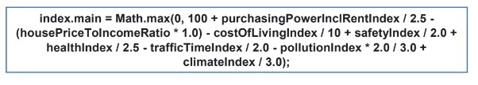
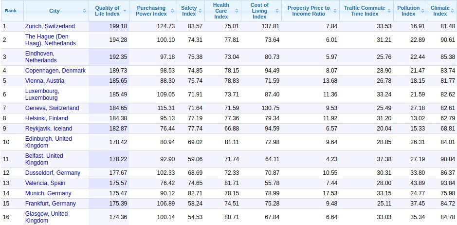
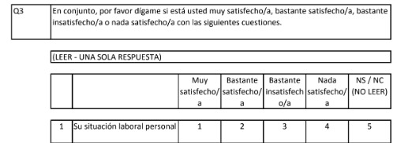
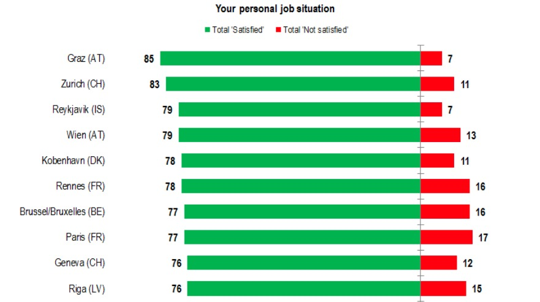
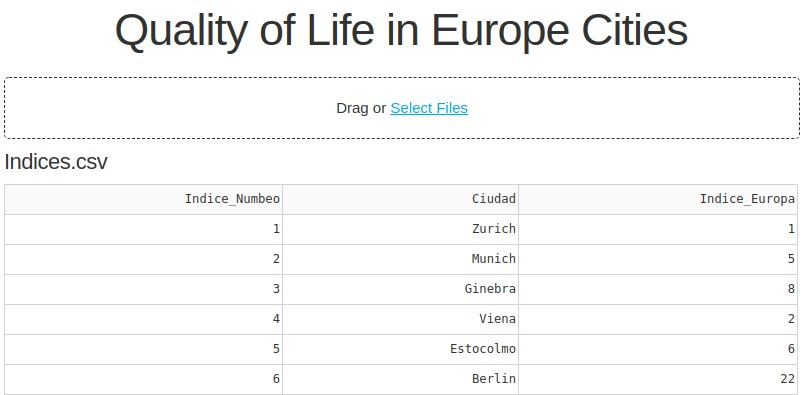
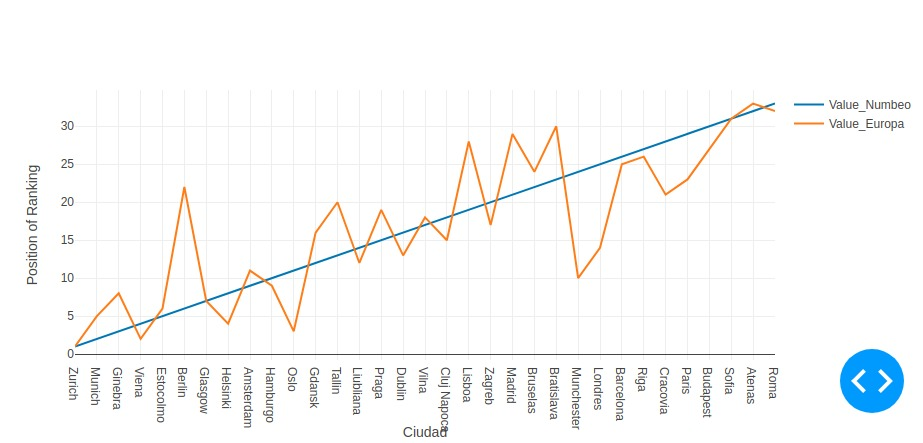

# Práctica final de GESTIÓN DE COMUNICACIÓN Y CONOCIMIENTO EMPRESARIAL

#### Alberto Martín Núñez

## Indice de contenidos

1. [Objetivo de la práctica](#id1)
2. [Recopilacion de informacion](#id2)
    1. [Método de Numbeo](#id2.1)
    2. [Método de Europa](#id2.2)
    3. [Limpieza de los datos](#id2.3)
3. [Visualización de los datos](#id3)
    1. [Herramientas utilizadas](#id3.1)
    2. [Metodología y Resultado Final](#id3.2)
4. [Conclusiones](#id4)


## Objetivo de la práctica <a name="id1"></a>

El objetivo de este trabajo final de la asignatura consiste en realizar una comparacion entre dos sistemas de medicion sobre la **Calidad de vidad** en las ciudades, centrándonos en las ciudades Europeas(concretamente en 33 ciudades, que son las comunes entres los dos sistemas de medición). Esto se ha hecho así porque Numbeo si contiene datos actualizados pero los datos de Europa vienen dados por un documento que se realiza cada ciertos años y aun no se ha publicado el nuevo, por tanto, los datos recopilados se remontan a los de 2015. A pesar de haber transcurrido 5 años, esta informacion nos es suficiente para realizar el estudio.

Se utilizarán dos sistemas de medición diferentes:

- Por un lado de forma cuantitativa, el método de Numbeo, basado en una fórmula.
- Y por otro lado, de manera cualitativa, el método de Europa, basado en una encuesta a la población.

Por ello se estudiarán los distintos métodos asi como los ranking que se obtendrán con el fin de observar si existen diferencias a la hora de medir la **calidad de vida** de forma nuḿerica o haciendo uso de una serie de preguntas a la población(cuestionario). 

Añadir que se han escogido estos dos métodos ya que tanto los parametros que utiliza numbeo y la preguntas que realiza Europa tienen bastantes similitudes en los aspectos que tocan para medir la calidad de vida. Esto se ha corroborado realizando una comparativa entre ambos métodos. Cabe destacar que existen otros métodos distintos para analizar ciudades y su calidad de vida pero me he decantado por estos dos ya que son fuentes famosas y con un largo recorrido y experiencia.

## Recopilación de información <a name="id2"></a>

Aqui hablaremos de donde hemos sacado la información de los distintos métodos y de que forma hemos escogido los datos para poder tener la información necesaria para mostrarla.

### Método de Numbeo <a name="id2.1"></a>

Numbeo es una base de datos global de múltiples fuentes de información sobre la calidad de vida en donde existen diversos indicadores como *tasas de criminilidad*, *calidad de atencion médica*. 

Numbeo nos proporciona una herramienta para poder ver, compartir y comparar sobre la calidad de vida en las ciudades. La calidad de vida para Numbeo se basa en los siguientes datos:

- Costo de vida
- Asequibilidad de la vivienda
- Contaminacion(aire,agua,etc)
- Tasas de crimen
- Calidad del sistema de salud
- Tráfico(tiempos de viaje)

El índice de calidad de vida (más alto es mejor) es una estimación de la calidad de vida general mediante el uso de una fórmula empírica que tiene en cuenta el índice de poder adquisitivo (más alto es mejor), el índice de contaminación (más bajo es mejor), el precio de la vivienda y la relación de ingresos (más bajo es mejor), índice de costo de vida (menor es mejor), índice de seguridad (mayor es mejor), índice de atención médica (mayor es mejor), índice de tiempo de viaje del tráfico (menor es mejor) e índice climático (mayor es mejor).


Con estos parámetros se crea una fórmula:




La cual es utilizada para sacar un valor para cada ciudad y de esta forma tener un ranking como el siguiente: 




Como se ha mencionado al principio, se ha escogido el ranking del año 2015 para poder comparar con el siguiente método a explicar.
 
### Método de Europa <a name="id2.2"></a>

Este Flash Eurobarameter, “Calidad de vida en las ciudades europeas” (n. ° 419), se realizó por medio de la Dirección General de Política Regional y Urbana con el objetivo de obtener una instantánea de opiniones de las personas sobre una serie de cuestiones urbanas. 

La encuesta se realizó en un total de 83 ciudades europeas. En cada ciudad se entrevistó a unos 500 ciudadanos, en total unos 40.798 encuestados de diferentes grupos demográficos.

En el propio documento PDF que se ha extraído con toda la información del *Flash Eurobarameter* se encuentran cada una de las preguntas que se realizaron y el porcentaje de las personas que estaban, "de media" , satisfechas con cada pregunta realizada.

Aqui tenemos un ejemplo con el resultado a la pregunta **"Your personal job situation"**:





El problema con estos datos es que no existe un ranking para poder ver de una forma más clara que ciudades son las que tienen mayor calidad de vida. Por lo que tuve que coger todos los resultados de cada pregunta(porcentajes) para cada ciudad y hacer una media para crear un ranking propio. 

Este resultado consiste en una tabla en excel bastanta grande como para añadirlo al informe, por eso, simplemente añado la tabla que hace referencia al ranking propio de las 83 ciudades.

*Destacar que el valor "Porcentaje 2015" corresponde con el porcentaje de personas satisfechas con todas las preguntas realizadas"*

| Nº |       Ciudad       | Porcentaje 2015 |
|:--:|:------------------:|:---------------:|
|  1 |       Zurich       |       85%       |
|  2 |       Aalborg      |       81%       |
|  3 |      Groningen     |       81%       |
|  4 |     Luxembourg     |       81%       |
|  5 |       Rennes       |       79%       |
|  6 |        Wien        |       79%       |
|  7 |        Oslo        |       79%       |
|  8 |      Helsinki      |       79%       |
|  9 |       Munchen      |       78%       |
| 10 |        Oulu        |       78%       |
| 11 |        Graz        |       78%       |
| 12 |       Cardiff      |       78%       |
| 13 |       Belfast      |       78%       |
| 14 |      Stockholm     |       77%       |
| 15 |       Glasgow      |       77%       |
| 16 |      Newcastle     |       77%       |
| 17 |      Antwerpen     |       77%       |
| 18 |      Bordeaux      |       76%       |
| 19 |       Geneva       |       76%       |
| 20 |      Kobenhavn     |       76%       |
| 21 |        Malmo       |       75%       |
| 22 |      Bialystok     |       75%       |
| 23 |     Strasbourg     |       75%       |
| 24 |       Oviedo       |       75%       |
| 25 |       Hamburg      |       75%       |
| 26 | Greater_Manchester |       74%       |
| 27 |       Rostock      |       74%       |
| 28 |      Rotterdam     |       74%       |
| 29 |       Leipzig      |       74%       |
| 30 |     Manchester     |       74%       |
| 31 |        Braga       |       74%       |
| 32 |      Amsterdam     |       73%       |
| 33 |      Ljubljana     |       73%       |
| 34 |       Dublin       |       72%       |
| 35 |      Reykjavik     |       72%       |
| 36 |       London       |       72%       |
| 37 |     Cluj_Napoca    |       72%       |
| 38 |       Gdansk       |       72%       |
| 39 |      Dortmund      |       71%       |
| 40 |       Zagreb       |       71%       |
| 41 |    Piatra_Neamt    |       69%       |
| 42 |        Essen       |       69%       |
| 43 |       Vilnius      |       69%       |
| 44 |       Burgas       |       69%       |
| 45 |        Praha       |       69%       |
| 46 |        Lille       |       68%       |
| 47 |       Tallinn      |       68%       |
| 48 |       Antalya      |       68%       |
| 49 |       Krakow       |       68%       |
| 50 |       Malaga       |       67%       |
| 51 |       Berlin       |       67%       |
| 52 |       Ostrava      |       67%       |
| 53 |       Verona       |       67%       |
| 54 |        Paris       |       67%       |
| 55 |  Brussel/Bruxelles |       67%       |
| 56 |    Greater_Paris   |       66%       |
| 57 |      Barcelona     |       65%       |
| 58 |      Warszawa      |       65%       |
| 59 |     Diyarbakir     |       65%       |
| 60 |        Liege       |       65%       |
| 61 |        Riga        |       65%       |
| 62 |       Kosice       |       64%       |
| 63 |   Greater_Lisbon   |       63%       |
| 64 |       Bologna      |       63%       |
| 65 |       Ankara       |       62%       |
| 66 |      Budapest      |       62%       |
| 67 |      Lefkosia      |       61%       |
| 68 |      Marseille     |       60%       |
| 69 |       Miskolc      |       60%       |
| 70 |       Torino       |       59%       |
| 71 |      Valletta      |       59%       |
| 72 |       Lisboa       |       58%       |
| 73 |       Madrid       |       58%       |
| 74 |     Bratislava     |       57%       |
| 75 |      Irakleio      |       56%       |
| 76 |        Sofia       |       54%       |
| 77 |      Bucuresti     |       54%       |
| 78 |      Istanbul      |       52%       |
| 79 |       Napoli       |       49%       |
| 80 |   Greater_Athens   |       48%       |
| 81 |        Roma        |       48%       |
| 82 |       Palermo      |       45%       |
| 83 |       Athina       |       44%       |


### Limpieza de los datos <a name="id2.3"></a>

Una vez que tenemos los ranking de distintos métodos vemos que cada uno de ellos tiene X ciudades que evalúa. En el caso de Numbeo(2015) evalúa 58 ciudades, en cambio Europa evalúa 83 ciudades. Para que podamos comparar entre ciudades de una forma más limpia, lo que se ha hecho es quedarnos con las ciudades comunes, obteniendo 33 ciudades Europeas.

También tenemos que tener en cuenta que los datos que tenemos para ambos métodos se dividen en 3 columnas: *Indice, Ciudad, Valor*. Para cada método el *valor* es diferente por tanto no tiene sentido comparar los valores entre ellos, por lo que nuestro parámetro importante es el **indice**, es decir, la posición que ocupa en el ranking de cada uno.

Comparando este valor podremos visualizar el indice de cada ciudad y analizar que posición ocupa para cada método de analisis.


*Es cierto que nos quedamos con un número de ciudades bastante reducidos y que la cantidad de los datos no es grande, pero el objetivo del estudio es comprobar la diferencia que existe, si la hubiera, de analizar la **calidad de vida** de forma cuantitativa o cualitativa.*

Por tanto, el resultado final es un archivo *csv* con las ciudades comunes entre los dos métodos y las posiciones de cada una de ellas para cada método de análisis. 

```csv
Indice_Numbeo,Ciudad,Indice_Europa
1 ,Zurich, 1
2 ,Munich, 5
3 ,Ginebra, 8
4 ,Viena, 2
5 ,Estocolmo, 6
6 ,Berlin, 22
7 ,Glasgow, 7
8 ,Helsinki, 4
9 ,Amsterdam, 11
10 ,Hamburgo, 9
11 ,Oslo , 3
12 ,Gdansk, 16
13 ,Tallin , 20
14 ,Liubliana, 12
15 ,Praga ,19
16 ,Dublin , 13
17 ,Vilna , 18
18 ,Cluj Napoca, 15
19 ,Lisboa , 28
20 ,Zagreb ,17
21 ,Madrid , 29
22 ,Bruselas, 24
23 ,Bratislava, 30
24 ,Munchester ,10
25 ,Londres , 14
26 ,Barcelona, 25
27 ,Riga , 26
28 ,Cracovia, 21
29 ,Paris ,23
30 ,Budapest, 27
31 ,Sofia ,31
32 ,Atenas ,33
33 ,Roma , 32
```

## Visualización de los datos <a name="id3"></a>

Una vez que tenemos el archivo con los datos necesarios se realiza una gráfico con ellos para visualizar de una forma más clara las diferencias de las posiciones para cada método asi podemos corroborar como varían las posiciones de las ciudades y ver si existe diferencias.

### Herramientas utilizadas <a name="id3.1"></a>

Para hacer la visualizacion se ha hecho un pequeño código en **Python** utilizando un framework llamado **Dash** diseñado para crear aplicaciones web. Es muy útil para crear cuadros de mando y aplicaciones de visualización.

### Metodología y Resultado Final <a name="id3.2"></a>

Primeramente veríamos lo siguiente en nuestra página web.


Desde aqui podemos añadir el archivo **indices.csv** que quremos representar. Hay que tener en cuenta que en primaria instancia lo hice para elegir a través de un dropdown los elementos que se quieren representar pero posteriormente lo modifique dado a que la representación que se quiere hacer es específica. 

El archivo *csv* tiene que tener 3 columnas *Indice_Numbeo,Ciudad,Indice_Europa*

Una vez cargado el archivo se nos mostrará una tabla con el contenido del archivo y justamente debajo un gráfico con los resultados:



*Esta sería algunos datos de la tabla de los archivos*


*Este sería el gráfico de los resultados*

Tenemos que fijarnos que la linea azul es una línea recta porque corresponde con los datos de Numbeo y las ciudades estan ordenadas según esa posición. Podría haberse puesto aleatorio pero creo que de esta forma es más fácil de comparar los resultados con los de Europa, esta es la línea naranja.


## Conclusiones <a name="id4"></a>